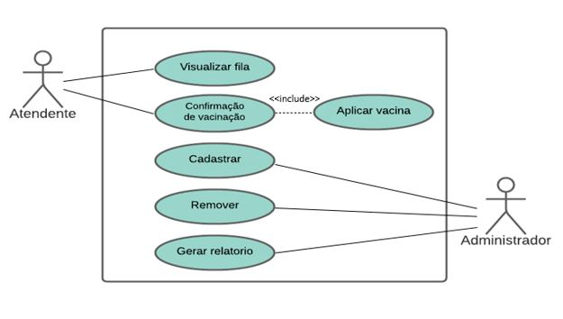
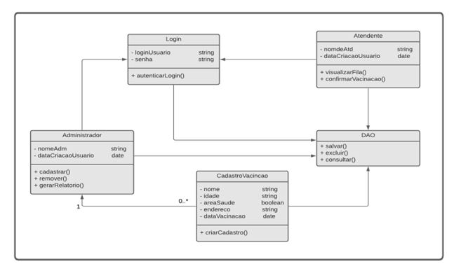

   

# Covid-Vaccination-Queue

Sistema para Controle de Vacinação da COVID-19.

  

# Problema

O Brasil registrou o primeiro caso de COVID em janeiro de 2020 e em janeiro de 2021 começou aplicação da vacinação. Atualmente, 10,8% da população brasileira foram totalmente vacinadas.

Por faltar muitas pessoas ainda para se vacinar, acabamos nos deparando com problemas, como:

- Mais de 700 pessoas são denunciadas por furar a fila da vacinação contra a COVID-19, no Paraná.

- Falta de critério único para a fila da vacina dificulta o controle de doses aplicadas em grupos prioritários.

# Solução

Um sistema que possibilite o controle e acompanhamento da fila de vacinação da COVID-19. Realizando a ordenação da fila de acordo com os grupos prioritários.

# Escopo Principal

Uma solução desktop contendo interface gráfica e banco de dados. O sistema controla acesso para somente usuários autenticados obterem suas funcionalidades, sendo eles:

Usuario Atendente:

- Responsável por visualizar a fila de vacinação no sistema e aplicar a vacina. Após a aplicação, o atendente confirma a vacinação no sistema.

Usuario Administrador:

- Responsável por cadastrar novos atendentes ao sistema, cadstrar pessoas que receberão a vacina e gerar relatório contendo dados da vacinação.

# Tecnologias

- Java
- MySQL

# Modelagem

### Diagrama de Caso de Uso

  

### Diagrama de Classes

  

# Adicionais

Para saber mais sobre o projeto clique no link abaixo para assitir o vídeo:
https://app.animaker.com/video/KVSB02698NCWZEP7
